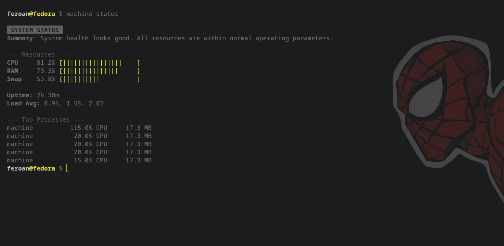
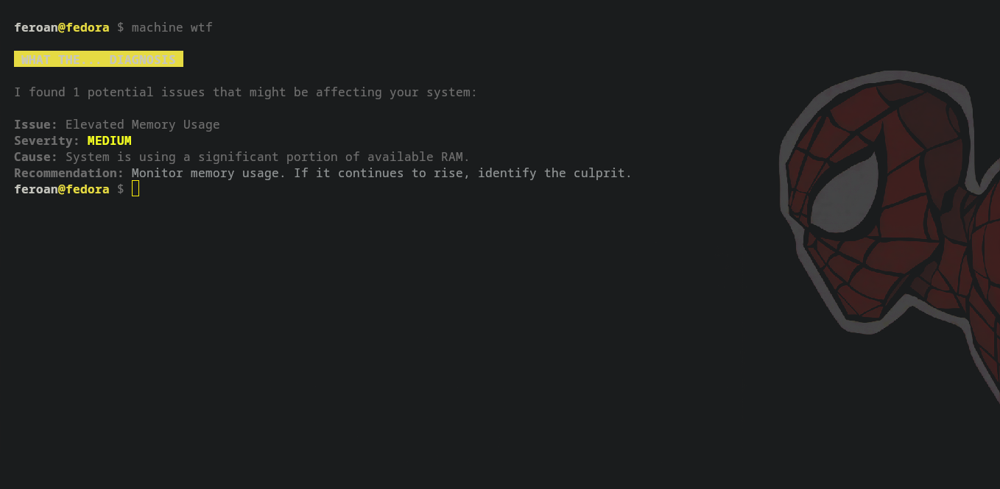
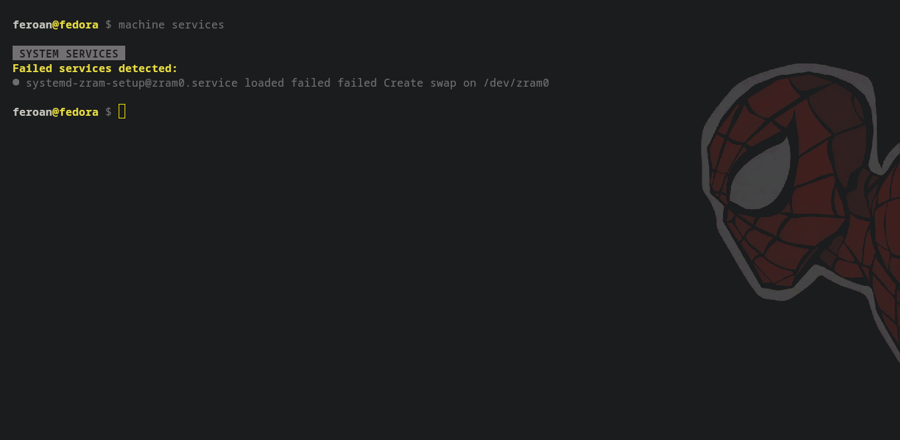
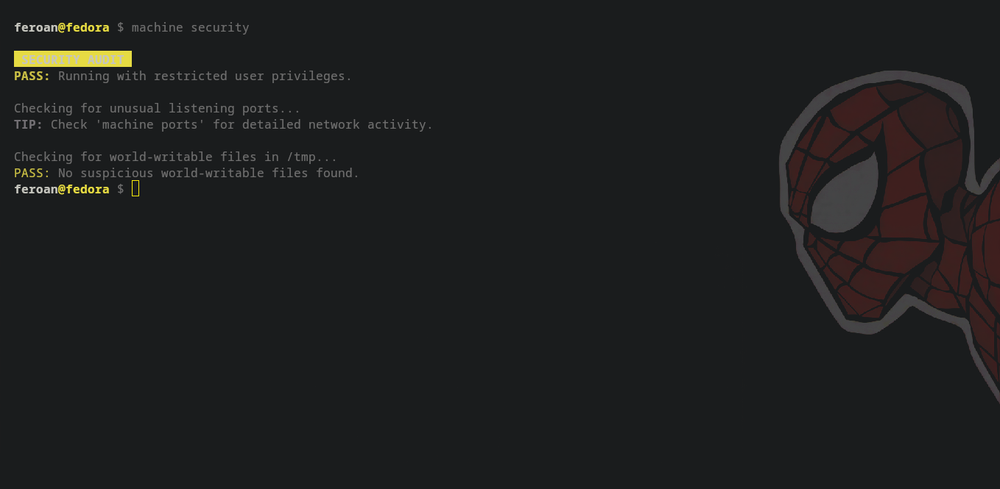

# Machine

[](https://github.com/Feroan101/machine/blob/main/LICENSE)
[](https://github.com/Feroan101/machine/releases)
[](https://github.com/Feroan101/machine/actions)

**Linux diagnostics that explain what's happening and why.**

Machine is a production-quality Linux CLI utility designed to translate technical system states into plain language. Unlike traditional tools that merely report statistics, Machine analyzes causes and provides actionable recommendations.

## Features

- **Health Summaries**: High-level resource and status overviews.
- **Predictive Diagnostics**: Forecast resource exhaustion and detect anomalies.
- **Deep Process Analysis**: Explain behavior and trace relationships.
- **Local Persistence**: Historical snapshots stored in a zero-dependency SQLite database.
- **Security Audits**: Read-only audits of ports, listeners, and permissions.

## Installation

### From Source (Recommended)
```bash
git clone https://github.com/Feroan101/machine
cd machine
./install.sh
```

For alternative methods, see the [Installation Guide](docs/installation.md).

## Quick Start

```bash
# Get a high-level summary
machine status

# Identify system bottlenecks
machine wtf

# Live system monitoring
machine watch

# Compact health snapshot
machine pulse

# Explain a specific process
machine why <process>

# Capture a snapshot for history
machine snapshot
```

## Screenshots

| Status | WTF |
| :---: | :---: |
|  |  |

| Services | Security |
| :---: | :---: |
|  |  |

## Documentation

- [Command Reference](docs/commands.md)
- [Installation Guide](docs/installation.md)
- [Troubleshooting](docs/troubleshooting.md)

## Philosophy

Machine is built on the belief that system monitoring should be approachable without sacrificing depth. We prioritize:
- **Speed**: Instantaneous startup and execution.
- **Privacy**: No telemetry, no cloud, no tracking.
- **Clarity**: Plain language over technical jargon.

## License

MIT Copyright 2026 Feroan.
